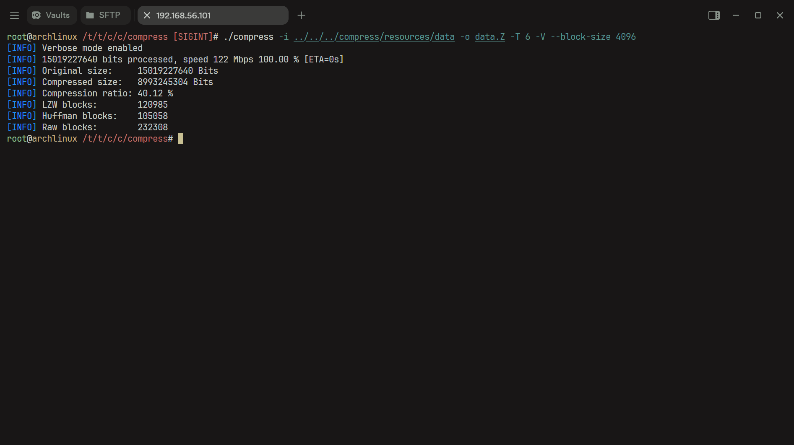
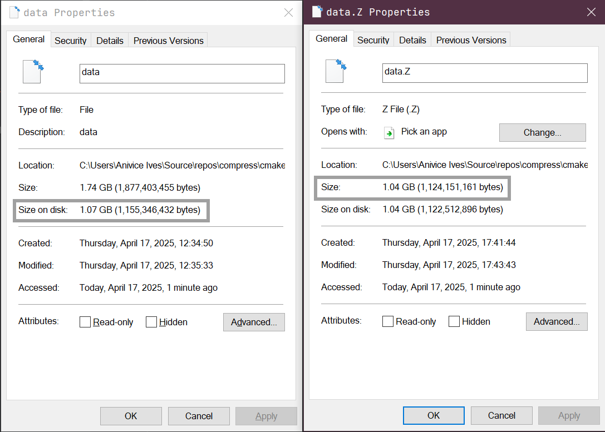

# Compression Algorithms and Their Implementations

## Introduction

This is an implementation of the two well-known and widely deployed compression algorithms,
namely Lempel-Ziv-Welch (LZW) and Huffman coding.

Lempel-Ziv-Welchm, or LZW in short for the sake of convenience naming,
typically employs a fixed bit size for the result in its coding style,
though the coding algorithm never specifically detailed any bit size and varying bit length 
in encoded data is fairly common.
Huffman coding, on the other hand, is known for its varying bit length in encoded data.

This implementation mixes these two algorithms in the hope that it can reach
the maximum compression result possible.

## Terminology

### *Unit Bit Size*, *Unit Size* and *Variable Bit Size*

**Unit Size** is the size of the smallest unit in a storage system.
**Unit Bit Size** is the bit size of the smallest unit in a storage system.
For example, for hard disks, their unit size, the smallest size of operation, is typically 512 bytes.
This means you can and only can read and write $N \times 512$ bytes at a time from its controller.
A typical computer system is 8-bit aligned in bits, with each 8 bits forming a byte,
and 4096-byte, i.e., 4 KB, aligned on disk filesystem.
This means that for a typical computer, the file size on disk is always $8 \times 4096 \times N$ bits.

Though computer storage usually employs unit size to boost performance and avoid severe fragmentation,
which can create small gaps that, when combined, 
are large enough to fit a new program, but cannot form a continuous usable space.
A variable size in a storage unit usually offers a lower storage requirement and in turn,
occupies less storage space and higher performance cost.

**Variable Bit Size** means that for each symbol represented in a continuous data stream,
its occupied bit size is not fixed and can change dynamically,
and for all symbols, their unit size does not necessarily agree with each other.

### Lempel-Ziv-Welchm Algorithm

Lempel-Ziv-Welchm algorithm can encode and decode data
without the knowledge on their full scale.
LZW can encode data stream and build a dictionary along with the encoding process,
and decoder can rebuild the dictionary in the decoding process.
LZW algorithm is most suitable for data with repeated symbol patterns.

### Huffman Coding

Huffman coding is a well-known coding algorithm with variable coding length.
It is suitable for data with huge variety in appearance frequency for its symbols.
High frequency data are encoded with shorter bits and low frequency data are encoded with longer codes,
resulting in fewer bits used in general.
Huffman coding requires a dictionary in the decoding process.

### Compression Ratio

Our definition of a compression ratio is "amount of data compressed in the process."
Specifically,

$$\text{Compression Ratio} = \frac{\text{Original Data Length} - \text{Data Length after Compression}}{\text{Original Data Length}} \times 100 \%$$

Higher compression ratio means better result.
Compression ratio can be a negative value, indicating data expanded after compression,
an extremely poor result.

## Implementations

Huffman coding sorts symbols in frequency order.
This is not ideal for dictionary storage since,
dictionary is exported with a fixed-length header.
In this example, we used four (4) bits for each symbol entry length.
Zero (0) means the symbol is not present, and entry can take as much as 15 bits at most.

Ideally, the maximum data block we can handle is $32 \text{KB} - 1$ for each symbol with a unique encoding.
However, it is entirely possible to have symbols exceeding the 15-bit encoding limit.
This is the reason why we utilized a simple balance technique,
in additional to the frequency sorting.
We assign symbols with low frequency first if the symbol typically has shorter encoding.
This way we decreased the possibility of encountering a symbol with non-ideal bit length.

This is also the reason why Huffman coding in our example always underperformed LZW
in almost every example.
As a compensation for this, we compress the result of Huffman coding again, with LZW.
This helps further reduce redundancies in the Huffman coding result.

However, some patterns are still more likely to have a higher compression ratio for LZW.
In this implementation, we did parallel compression.
We compress the same data using LZW and Huffman-LZW, and compare the result.
Better result will be chosen as output.
If compression ratios are both negative,
original data (no compression) will be used instead.

## Utility Compile and Usage

### Before Compiling

#### Requirements

You need CMake to build this project.

##### **On Windows**

On Windows, you need Visual Studio 2022 or newer.
This project uses C++ 23 specifications and is not supported in older versions.

#### **On UNIX-Like (\*BSD, Linux)**

You need GCC 14 or newer, and a build tool like "UNIX Makefile" or Ninja.

### Compile

```bash
git clone https://github.com/Anivice/lzw && cd lzw && mkdir -p build && cd build && cmake ..  -DCMAKE_BUILD_TYPE=Release && cmake --build . --config=Release
```

The above command works on all systems.

### Usage

#### `compress`

```bash
compress [OPTIONS]
OPTIONS: 
    -h,--help            Show this help message
    -o,--output          Set output file
    -i,--input           Set input file
    -v,--version         Get utility version
    -T,--threads         Multi-thread compression
    -V,--verbose         Enable verbose mode
    -H,--huffman-only    Disable LZW compression size comparison
    -L,--lzw-only        Disable Huffman compression size comparison
    -A,--archive         Disable compression
    -B,--block-size      Set block size (in bytes, default 16384 (16KB), 32767 Max (32KB - 1))
```

#### `decompress`

```bash
decompress [OPTIONS]
OPTIONS: 
    -h,--help       Show this help message
    -o,--output     Set output file
    -i,--input      Set input file
    -v,--version    Get utility version
    -T,--threads    Multi-thread decompression
    -V,--verbose    Enable verbose mode
```

### Obtain Test Data

Test data can be obtained only if you install git large file extension `git-lfs`.
Details can be found [here](https://git-lfs.com/).

If you have already installed `git-lfs`, you can obtain test data using the following command,
if test data is not already pulled automatically in the clone process:

```bash
git lfs install && git lfs checkout && git lfs pull
```

### Test Result

#### Compression Result on Example Data



#### Size Comparison with Windows NTFS Transparent Compression

Windows transparent compression result (Left) is somewhat larger than our result (right).


